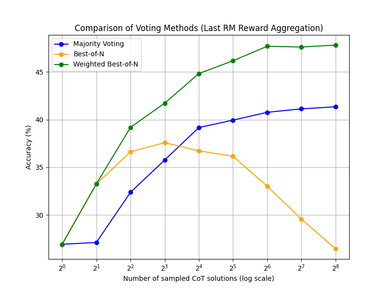
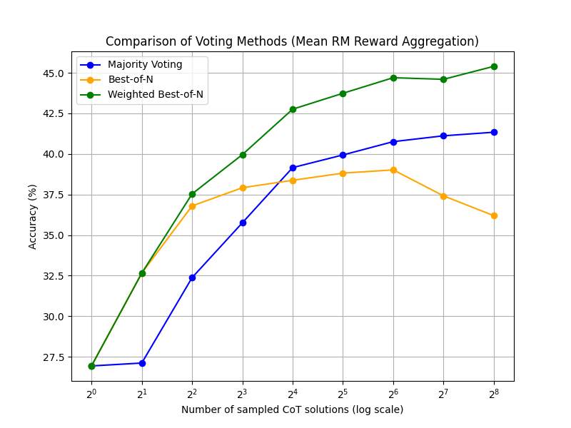
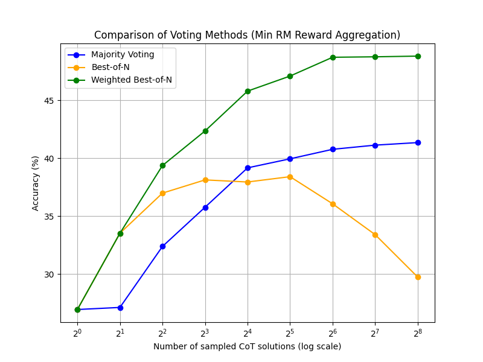

# ComputeScaling-Replication
replication of part of the huggingface blog  https://huggingface.co/spaces/HuggingFaceH4/blogpost-scaling-test-time-compute

Since the details of grading implementation in the blog is not enough to reproduce the results in the blog, i adapted the grading code in the https://github.com/openai/prm800k 

Using "last" as the aggregation method:

Using "mean" as the aggregation method:

Using "min" as the aggregation method:
